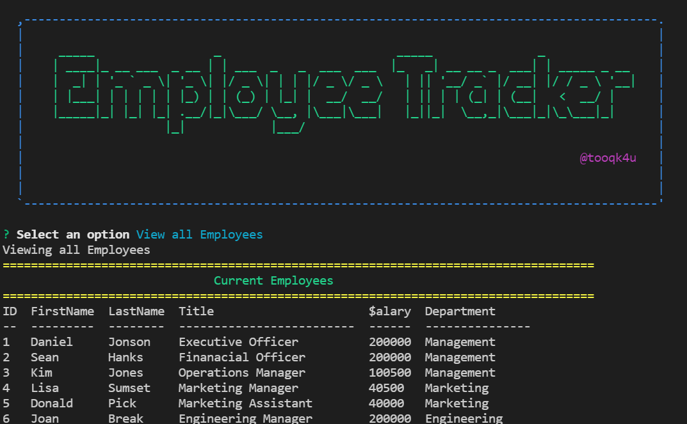

# Employee Tracker
  

---
## Link
https://drive.google.com/file/d/16uN31aRwsMttfUDWhgveZG_Y4xO139bm/view

## Description 

  
Keep track of your employees through back end databases through the use of MySQL and Node.js inquirer. You can see a list of all the Employees, their title, Roles, Salary, and Departmet.

##### SCREENSHOT EXAMPLE OF GENERATED Employee Tracker

---
  
## Table of Contents 

* [Installation](#installation)
* [Usage](#usage)
* [Contributing](#contributing)
* [Tests](#tests)
* [Questions](#questions)
* [Credits](#credits)
* [License](#license)

---
---

## Installation

Install MySQL and Node Inquirer through the command line termainal. Type in "npm init" then install dependencies as needed such as MySQL2, chalk, asciiart-logo and inquirer" .

---
---

## Usage

Once in the root directory after cloning the repo, open terminal and type "mysql -u root -p" to open the mysql terminal line, then add your database by typing "CREATE DATABASE employee_tracker" and then type "USE employee_tracker". Then type "source db/schema.sql" and "source db/seeds.sql". To verify tables were created you can type "SHOW TABLES" then follow mysql prompts to open a table such as "SELECT * FROM employee;". Then type "quit" to go back to root command line and then to start prompts type "node server" or "node server.js" and follow the prompts.

---
---

## License

Information on the license(s)

https://opensource.org/licenses/MIT

---
---

## Contributing

Guidelines for contributions:

NA

---
---

## Tests

NA

---
---

## Questions?

Contact me at

Email: [tooqk4u@protonmail.com](mailto:tooqk4u@protonmail.com)

GitHub: [tooqk4u](https://github.com/tooqk4u).

 ---
 ---

## Credits 
 
Shelley Soucie

---
---

[Back to Contents](#table-of-contents)
